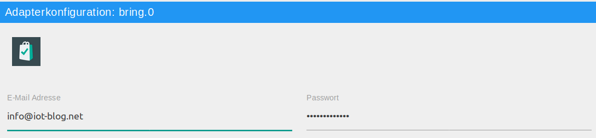
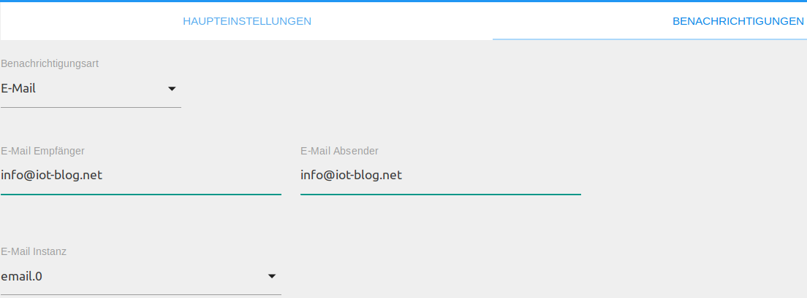

# Bring! Adapter

Der Bring! Adapter ermöglicht die Einbindung aller Bring! Einkaufslisten eines Nutzers.

## Überblick

### Bring!
Bei Bring! handelt es sich um eine Applikation für mobile Endgeräte sowie Web-App, um Einkaufslisten kollaborativ zu 
nutzen. So kann im Haushalt gemeinsam eine Einkaufsliste genutzt werden und wird automatisch mit den anderen Mitgliedern
der Liste synchronisiert.

### Bring! Adapter
Der Bring! Adapter findet nach Anmeldung mittels E-Mail Adresse und Passwort des Bring! Accounts automatisch alle Listen
des entsprechenden Nutzers. 
<br/>
Der Adapter legt automatisch alle Listen in Form von Channels an und bietet neben der Darstellung der Liste als JSON 
sowie HTML auch die Möglichkeit neue Gegenstände auf die Liste zu setzen und zu entfernen.

## Voraussetzungen vor der Installation
Es muss ein Bring! Account existieren und eine Internetverbindung bestehen. Ein Bring! Account kann über die mobile 
Applikation auf dem Smartphone angelegt werden.

## Installation
Eine Instanz des Adapters wird über die ioBroker Admin-Oberfläche installiert. 
Die ausführliche Anleitung für die dazu notwendigen Installatonschritte kann hier (TODO:LINK) nachgelesen werden.
<br/><br/>
Nach Abschluss der Installation einer Adapterinstanz öffnet sich automatisch ein Konfigurationsfenster.

## Konfiguration


<span style="color:grey">*Tab Haupteinstellungen*</span>

| Feld         | Beschreibung |                                                                       
|:-------------|:-------------|
|E-Mail Adresse|E-Mail Adresse des Bring! Accounts|
|Passwort|Passwort des zugehörigen Accounts|

<span style="color:grey">*Tab Benachrichtigungen*</span>

Falls es gewünscht ist, Benachrichtigungen per Mail zu erhalten, kann dies im Tab __Benachrichtigungen__ konfiguriert 
werden. Bei Betätigung des `messageTrigger` Buttons einer Liste, wird diese Liste an die konfigurierten Empfänger versendet.

| Feld         | Beschreibung |                                                                       
|:-------------|:-------------|
|Benachrichtigungsart|Art der Benachrichtigung (E-Mail, Pushover, Telegram|
|E-Mail Empfänger|Empfänger der Mail|
|Telegram Empfänger|Empfänger der Telegram Nachricht|
|E-Mail Absender|Absender Adresse der E-Mail|
|Device ID (optional)| Pushover Device ID des Empfängers|
|E-Mail/Pushover/Telegram Instanz|Instanz zum Versenden der Nachricht|

Nach Abschluss der Konfiguration wird der Konfigurationsdialog mit `SPEICHERN UND SCHLIEßEN` verlassen. 
Dadurch efolgt im Anschluß ein Neustart des Adapters.

## Instanzen
Die Installation des Adapters hat im Bereich `Instanzen` eine aktive Instanz des Bring! Adapters angelegt.
<br/><br/>
<span style="color:grey">  
*Erste Instanz*</span>

Auf einem ioBroker Server können mehrere Bring! Adapter Instanzen angelegt werden. 
Sollen mehrere Accounts von einem ioBroker Server synchronisiert werden, sollte 
je Account eine Instanz angelegt werden.
<br/><br/>
Ob der Adapter aktiviert oder mit der Bring! API verbunden ist, wird mit der Farbe des Status-Feldes der 
Instanz verdeutlicht. Zeigt der Mauszeiger auf das Symbol, werden weitere Detailinformationen dargestellt. 

## Objekte des Adapters
Im Bereich `Objekte` werden in einer Baumstruktur alle vom Adapter im Account 
erkannten Listen aufgeführt. 

<span style="color:grey">  
*Objekte des Bring! Adapters*</span>

Jeder Datenpunkt ist mit seinem zugehörigen Datentyp sowie seinen Berechtigungen aufgehführt. 
Berechtigungen können lesend (R) sowie schreibend (W) sein. Jeder Datenpunkt kann mindestens gelesen (R) werden, während
andere ebenfalls beschrieben werden können. Zur Suche nach einem bestimmten Datenpunkt empfiehlt sich die Suche mittels 
der Tastenkombination "STRG + F".

### Channel: info
* info.connection

    |Datentyp|Berechtigung|                                                                       
    |:---:|:---:|
    |boolean|R|

   *Read-only boolean Wert, der aussagt ob die Verbindung zur API hergestellt ist.*
   
* info.user

    |Datentyp|Berechtigung|                                                                       
    |:---:|:---:|
    |string|R|

   *Read only string. Beinhaltet den Namen des eingeloggten Nutzers*
   
### Einkaufslisten
Für jede Einkaufsliste wird ein Channel mit den folgenden Objekten angelegt:

* *list*.content / *list*.contentHtml/NoHead

    |Datentyp|Berechtigung|                                                                       
    |:---:|:---:|
    |string|R|

   *Read only json/html string formatiert als Liste, bzw. HTML Tabelle.
   Beinhaltet die Gegenstände die aktuell auf der Einkaufsliste stehen.
   Die NoHead HTML Tabellen sind ohne HTML Header.*
   
* *list*.recentContent / *list*.recentContentHtml/NoHead

    |Datentyp|Berechtigung|                                                                       
    |:---:|:---:|
    |string|R|

    *Read only json/html string formatiert als Liste, bzw. HTML Tabelle.
   Beinhaltet die Gegenstände die kürzlich auf der Einkaufsliste standen.
   Die NoHead HTML Tabellen sind ohne HTML Header.*
   
* *list*.removeItem

    |Datentyp|Berechtigung|                                                                       
    |:---:|:---:|
    |string|R/W|

   *Mit diesem State kann ein Gegenstand von der Einkaufsliste entfernt werden. 
   Der State wird bestätigt, sobald das Kommando von der Bring! API bestätigt wurde.*
   
* *list*.moveToRecentContent

    |Datentyp|Berechtigung|                                                                       
    |:---:|:---:|
    |string|R/W|

   *Mit diesem State kann ein Gegenstand zur recentContent Liste bewegt bzw. hinzugefügt werden. 
   Der State wird bestätigt, sobald das Kommando von der Bring! API bestätigt wurde.*
   
* *list*.saveItem

    |Datentyp|Berechtigung|                                                                       
    |:---:|:---:|
    |string|R/W|

   *Erlaubt das hinzufügen eines Gegenstandes zur Einkaufsliste. Durch das folgende Schema, können zusätzliche
   Spezifikationen mitgegeben werden:* 
   
   ```Apple, 2.50 $, the green ones```
   
   *Hierbei wird alles nach dem ersten Komma, als Spezifikation gewertet und erscheint in der App unter dem Gegenstand. 
   Der State wird bestätigt, sobald das Kommando von der Bring! API bestätigt wurde.*
    
* *list*.users / *list*.usersHtml/NoHead

    |Datentyp|Berechtigung|                                                                       
    |:---:|:---:|
    |string|R|

    *Read only json/html string formatiert als Liste, bzw. HTML Tabelle.
   Beinhaltet alle Nutzer die derzeit Mitglied der Liste sind.
   Die NoHead HTML Tabellen sind ohne HTML Header.*
   
* *list*.count

    |Datentyp|Berechtigung|                                                                       
    |:---:|:---:|
    |number|R|

   *Read only number, welcher anzeigt, wie viele Gegenstände sich derzeit auf der Einkaufsliste befinden.*
   
* *list*.messageTrigger

    |Datentyp|Berechtigung|                                                                       
    |:---:|:---:|
    |button|R/W|
    
    *Bei Betätigung des Buttons, wird eine Nachricht mittels Pushover, E-Mail und/oder Telegram and die konfigurierten
     Instanzen versendet, welche die aktuelle Einkaufsliste enthält.*
     
* *list*.enumSentence

    |Datentyp|Berechtigung|                                                                       
    |:---:|:---:|
    |string|R|
    
    *Nur lesbarer String, welcher eine Auflistung der aktuellen Gegenstände in sprechbarer Form enthält. 
    Eignet sich z. B. zur Sprachausgabe via Sprachassistenten.*